# P5.3 - Informe RA3 sobre el despliegue (WildFly contenedor + Gradle)

---

## a) Componentes y funcionamiento de los servicios del servidor

Los componentes que intervienen en el despliegue son:
- Docker: Es el encargado de ejecutar WildFly dentro de un contenedor sin necesidad de instalarlo en la maquina. Si algo falla borro el contenedor y lo creo de cero.
- WildFly: Es el servidor de aplicaciones. Se encarga de recibir las peticiones HTTP por el puerto 8080 y enviarlas a la aplicacion desplegada.
- WAR (crud-file.war): Es el archivo que contiene la aplicacion empaquetada (clases Java, web.xml, index.html). Lo genero con Gradle y lo copio al contenedor en `/opt/jboss/wildfly/standalone/deployments/`. WildFly lo detecta solo y lo despliega.
- Gradle: Es el encargado de compilar el codigo Java y generar el WAR.
- Puerto 8080: Es el puerto de aplicaciones, por aqui va todo el trafico de los usuarios hacia la API y el frontend.
- Puerto 9990: Es el puerto de la consola de administracion de WildFly. Permite gestionar el servidor, ver despliegues, etc.
- Endpoints REST: La aplicacion expone una API CRUD de tareas en `/crud-file/api/tasks` con los metodos GET, POST, PUT y DELETE.
- Nginx: Se usa como servidor web frontal que redirige las peticiones al WildFly. Esto lo implemento en el punto i) con Docker Compose.

### Flujo de una peticion

Cuando escribo una URL en el navegador o lanzo un curl, la peticion llega al puerto 8080 donde Docker la pasa al contenedor de WildFly. WildFly mira la URL, ve que empieza por `/crud-file` y sabe que es para nuestra app. Despues mira el resto de la ruta (`/api/tasks`) y el metodo HTTP (GET, POST, etc.) para saber a que funcion Java llamar. Esa funcion hace lo que tenga que hacer (leer tareas, crear una nueva, etc.) y devuelve la respuesta en JSON.

### Evidencias

Contenedor WildFly activo con los puertos publicados:

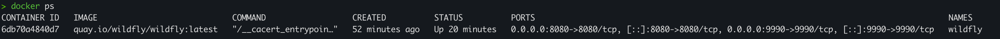

Logs de WildFly mostrando el arranque y despliegue:

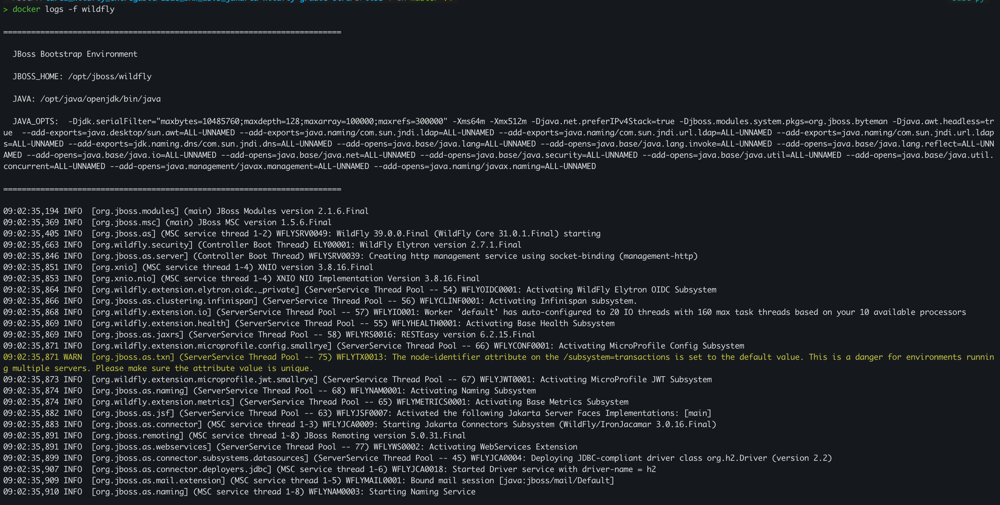

Prueba con curl creando una tarea:

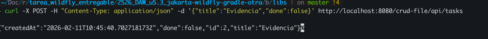

---

## b) Archivos principales de configuracion y bibliotecas compartidas

El archivo principal que gobierna WildFly es el `standalone.xml`, que esta en:

```
/opt/jboss/wildfly/standalone/configuration/standalone.xml
```

Este archivo controla todo el servidor. Algunas cosas que se pueden tocar ahi:
- Datasources: para configurar conexiones a bases de datos
- Logging: para cambiar el nivel de logs (DEBUG, INFO, ERROR)
- Puertos: para cambiar el 8080 por otro o restringir desde que IPs se acepta trafico

Tambien hay otros archivos importantes en esa carpeta:
- `mgmt-users.properties` — usuarios de administracion
- `application-users.properties` — usuarios de aplicacion
- `logging.properties` — configuracion de logs del arranque

Evidencia del listado de la carpeta de configuracion:

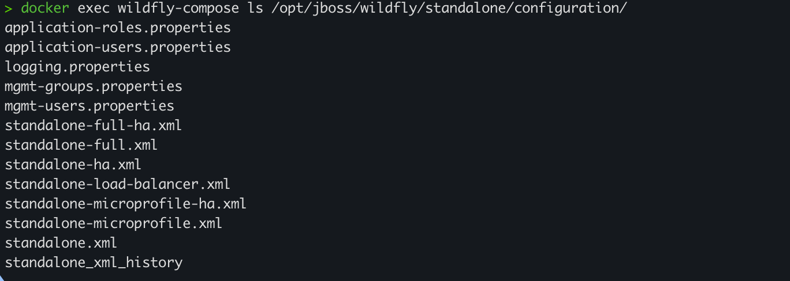

### Dependencias

En el `build.gradle` la dependencia de Jakarta EE esta marcada como `compileOnly`:

```gradle
dependencies {
    compileOnly 'jakarta.platform:jakarta.jakartaee-api:10.0.0'
}
```

Esto quiere decir que esa dependencia solo se usa para compilar pero no se mete dentro del WAR ya que WildFly ya incluye todas las librerias de Jakarta EE. Asi el WAR es mas ligero y no hay conflictos de versiones.

---

## c) Cooperacion con el servidor web (proxy / reverse proxy) y HTTPS

En la P5.2 accedemos directamente a WildFly por `localhost:8080`. Pero lo que he hecho es poner un Nginx delante que actua como reverse proxy.

### Configuracion del reverse proxy

```nginx
server {
    listen 80;

    location / {
        proxy_pass http://wildfly:8080/crud-file/;
        proxy_set_header Host $host;
        proxy_set_header X-Real-IP $remote_addr;
        proxy_set_header X-Forwarded-For $proxy_add_x_forwarded_for;
        proxy_set_header X-Forwarded-Proto $scheme;
    }
}
```

Con esto el usuario accede a `http://localhost/` y Nginx reenvia la peticion a WildFly. El puerto 9990 no se publica asi que desde fuera nadie puede acceder a la consola de administracion.

Lo que cambia respecto a acceder directamente:
- El usuario ya no accede a WildFly directamente sino a Nginx
- Solo se publica el puerto 80/443 (Nginx), no el 8080 ni el 9990
- WildFly queda en una red interna de Docker, invisible desde fuera

### HTTPS

He generado certificados autofirmados con este comando:

```bash
openssl req -x509 -nodes -days 365 -newkey rsa:2048 \
  -keyout certs/nginx.key -out certs/nginx.crt \
  -subj "/CN=localhost"
```

Y he añadido al nginx.conf el bloque para HTTPS:

```nginx
server {
    listen 443 ssl;

    ssl_certificate     /etc/nginx/certs/nginx.crt;
    ssl_certificate_key /etc/nginx/certs/nginx.key;

    location / {
        proxy_pass http://wildfly:8080/crud-file/;
        proxy_set_header Host $host;
        proxy_set_header X-Real-IP $remote_addr;
        proxy_set_header X-Forwarded-Proto $scheme;
    }
}
```

---

## d) Mecanismos de seguridad del servidor de aplicaciones

Las medidas de seguridad que he aplicado son:
- He creado un usuario de administracion con contraseña para la consola del 9990 usando `add-user.sh`
- He usado un contenedor Docker, lo que aisla WildFly del sistema host

Evidencia del contenedor con los puertos publicados (8080 y 9990 visibles):


---

## e) Componentes web del servidor de aplicaciones

El WAR es un archivo comprimido (como un ZIP) que contiene todo lo que necesita la aplicacion: las clases Java compiladas, el `web.xml`, el `index.html` y los recursos. El nuestro se llama `crud-file.war`.

Cuando WildFly despliega un WAR le asigna un contexto basado en el nombre del fichero. Como el nuestro se llama `crud-file.war` el contexto es `/crud-file`. Todo lo de la app empieza por ahi.

WildFly usa Undertow como servidor web interno. Es el que escucha en el puerto 8080 y recibe las peticiones HTTP para enviarlas a la app correcta segun la URL.

Si cogemos la URL `http://localhost:8080/crud-file/api/tasks`, `localhost:8080` es el host y puerto de WildFly, `/crud-file` es el contexto de la app (sale del nombre del WAR), `/api` es la ruta base que se define con `@ApplicationPath("/api")` en el codigo y `/tasks` es el recurso que se define con `@Path("/tasks")`. Con todo eso WildFly sabe a que clase y metodo llamar.

Evidencia de la copia del WAR al contenedor:

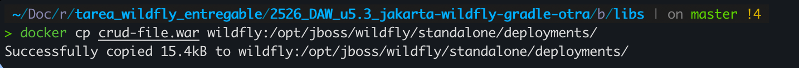

Respuesta del navegador mostrando el JSON:

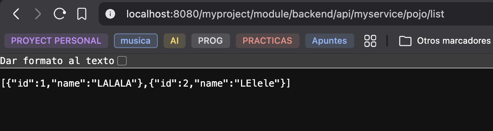

---

## f) Parametros necesarios para el despliegue

Los parametros que he necesitado para que funcione el despliegue son:

1. `-p 8080:8080` — Para publicar el puerto de aplicaciones. Sin esto no se puede acceder a la API desde fuera del contenedor.

2. `-p 9990:9990` — Para publicar la consola de administracion. Sin esto no se puede gestionar WildFly desde el navegador.

3. `-b 0.0.0.0` — Le dice a WildFly que acepte peticiones desde cualquier IP ya que sin esto solo escucha en localhost dentro del contenedor y las peticiones desde fuera no llegan.

4. `-bmanagement 0.0.0.0` — Igual que el anterior pero para la consola de administracion.

5. `archiveFileName = 'crud-file.war'` — Es el nombre del WAR en el `build.gradle`. Define el contexto de la app (`/crud-file`).

6. Ruta de despliegue — `/opt/jboss/wildfly/standalone/deployments/`. Es donde WildFly busca los WAR para desplegarlos. Si copio el WAR en otra ruta WildFly no lo detecta.

7. `sourceCompatibility = JavaVersion.VERSION_17` — La version de Java con la que se compila. Si compilo con una version mas alta de la que tiene WildFly (Java 21) el despliegue falla con `UnsupportedClassVersionError`.

### Evidencias

Clonacion del repositorio:

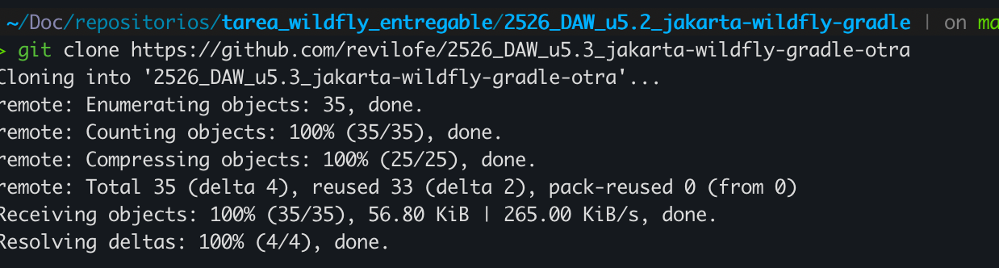

Generacion del wrapper de Gradle:

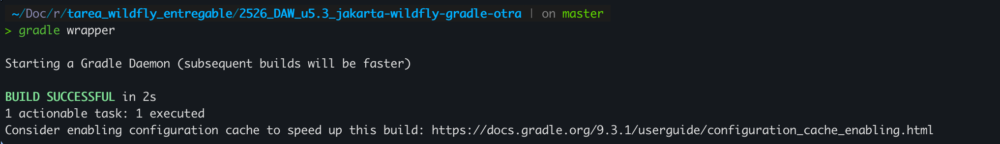

Build del WAR con Gradle:

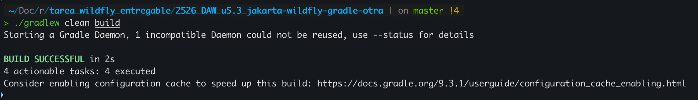

Copia del WAR al contenedor:


---

## g) Pruebas de funcionamiento y rendimiento

### Pruebas funcionales

He probado todos los endpoints con curl:

```bash
# Crear tarea
$ curl -X POST -H "Content-Type: application/json" \
  -d '{"title":"Tarea de prueba","done":false}' \
  http://localhost:8080/crud-file/api/tasks
{"createdAt":"2026-02-11T10:45:22.852Z","done":false,"id":1,"title":"Tarea de prueba"}

# Listar tareas
$ curl http://localhost:8080/crud-file/api/tasks
[{"createdAt":"2026-02-11T10:45:22.852Z","done":false,"id":1,"title":"Tarea de prueba"}]

# Actualizar tarea
$ curl -X PUT -H "Content-Type: application/json" \
  -d '{"title":"Tarea actualizada","done":true}' \
  http://localhost:8080/crud-file/api/tasks/1

# Eliminar tarea
$ curl -X DELETE http://localhost:8080/crud-file/api/tasks/1
```

Todos respondieron bien (201 Created, 200 OK, 204 No Content).

Evidencia de curl POST creando una tarea:


### Prueba de rendimiento con ApacheBench

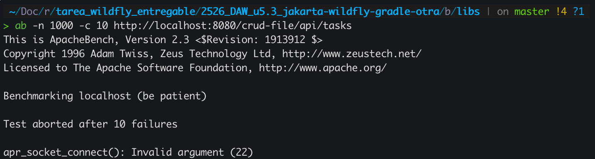

He lanzado 1000 peticiones con 10 usuarios simultaneos al endpoint de listar tareas:

```bash
ab -n 1000 -c 10 http://localhost:8080/crud-file/api/tasks
```

Se completaron las 1000 peticiones sin ningun fallo. El servidor aguanto unas 1150 peticiones por segundo con una latencia media de unos 8.7 ms por peticion. La mitad se resolvieron en 5 ms o menos y el 95% en menos de 21 ms. La mas lenta tardo 85 ms. El servidor se mantuvo estable sin errores.

---

## h) Documentacion de administracion y recomendaciones

Para levantar el entorno:

```bash
docker compose up -d
```

Esto levanta Nginx + WildFly con la app ya desplegada. Nginx espera a que WildFly este sano antes de arrancar.

Para desplegar una nueva version del WAR:

```bash
# Compilar el proyecto
./gradlew clean build

# Reconstruir y levantar
docker compose up -d --build
```

Para comprobar el estado:

```bash
# Ver que los contenedores estan corriendo
docker compose ps

# Ver los logs de WildFly
docker compose logs -f wildfly

# Probar que la API responde
curl http://localhost/api/tasks
```

---

## i) Virtualizacion, nube o contenedores en el despliegue

He montado un despliegue con Docker Compose que incluye Nginx como servidor web frontal y WildFly como servidor de aplicaciones.

### Dockerfile

```dockerfile
FROM quay.io/wildfly/wildfly:latest

USER root
RUN mkdir -p /opt/jboss/wildfly/standalone/log && \
    chown -R jboss:jboss /opt/jboss/wildfly/standalone/log
USER jboss

COPY build/libs/crud-file.war /opt/jboss/wildfly/standalone/deployments/

CMD ["/opt/jboss/wildfly/bin/standalone.sh", "-b", "0.0.0.0"]
```

### nginx.conf

```nginx
server {
    listen 80;

    location / {
        proxy_pass http://wildfly:8080/crud-file/;
        proxy_set_header Host $host;
        proxy_set_header X-Real-IP $remote_addr;
        proxy_set_header X-Forwarded-For $proxy_add_x_forwarded_for;
        proxy_set_header X-Forwarded-Proto $scheme;
    }
}

server {
    listen 443 ssl;

    ssl_certificate     /etc/nginx/certs/nginx.crt;
    ssl_certificate_key /etc/nginx/certs/nginx.key;

    location / {
        proxy_pass http://wildfly:8080/crud-file/;
        proxy_set_header Host $host;
        proxy_set_header X-Real-IP $remote_addr;
        proxy_set_header X-Forwarded-For $proxy_add_x_forwarded_for;
        proxy_set_header X-Forwarded-Proto $scheme;
    }
}
```

### docker-compose.yml

```yaml
services:
  wildfly:
    build: ./2526_DAW_u5.3_jakarta-wildfly-gradle-otra
    container_name: wildfly-compose
    networks:
      - interna
    volumes:
      - wildfly-logs:/opt/jboss/wildfly/standalone/log
    healthcheck:
      test: ["CMD-SHELL", "curl -f http://localhost:8080/crud-file/api/tasks || exit 1"]
      interval: 30s
      timeout: 10s
      retries: 3
      start_period: 30s
    restart: unless-stopped
    deploy:
      resources:
        limits:
          cpus: "1.0"
          memory: 512M

  nginx:
    image: nginx:alpine
    container_name: nginx-compose
    ports:
      - "80:80"
      - "443:443"
    volumes:
      - ./nginx/nginx.conf:/etc/nginx/conf.d/default.conf:ro
      - ./certs:/etc/nginx/certs:ro
    networks:
      - interna
    depends_on:
      wildfly:
        condition: service_healthy
    restart: unless-stopped

networks:
  interna:
    driver: bridge

volumes:
  wildfly-logs:
```

### Que se consigue con esto

- WildFly esta en una red interna. Solo Nginx es accesible desde fuera por los puertos 80 y 443. El 8080 y 9990 de WildFly no se publican
- Los logs de WildFly se guardan en un volumen para que no se pierdan si borro el contenedor
- Docker comprueba cada 30 segundos que la API responde. Si falla 3 veces marca el contenedor como unhealthy
- Si un contenedor se cae Docker lo levanta automaticamente
- WildFly no puede consumir mas de 1 CPU y 512 MB de RAM

### Evidencias

docker compose ps mostrando Nginx y WildFly:

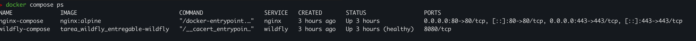

WildFly solo expone el 8080 internamente. Nginx es el unico punto de entrada.

Prueba HTTPS a traves de Nginx:

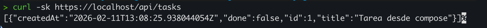
